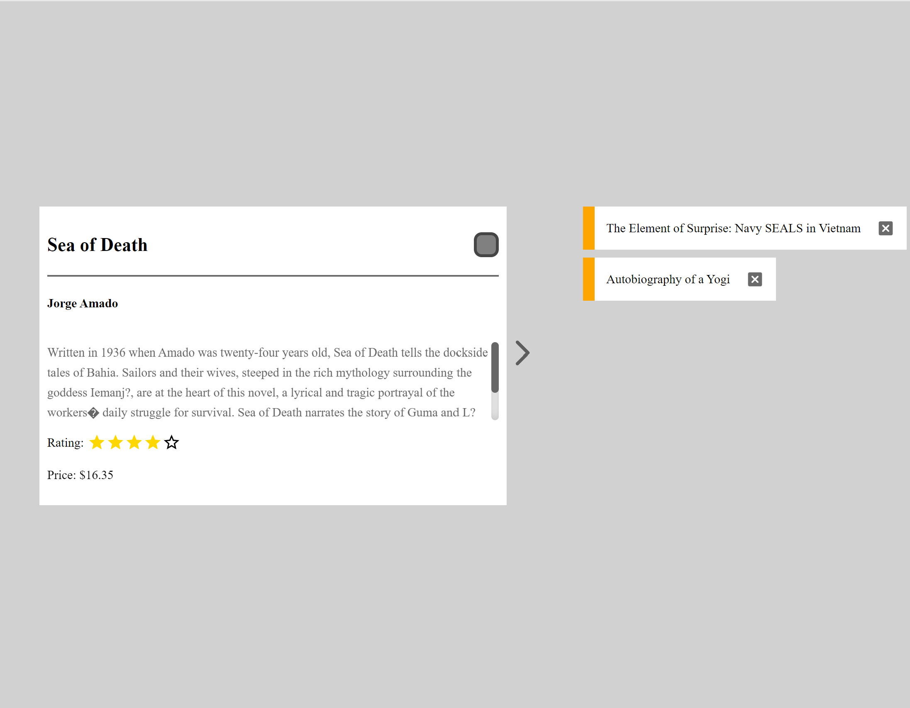

<h1 align="center"> Book Wishlist</h1>

<p> This application was written in three hours as a front-end exercise.<p>
You can check it out [here ](https://esheleyni.github.io/book-wishlist/).




### Table of Contents
- [App Description](#app-description)
- [Technologies](#technologies)
- [Getting started](#getting-started)
- [Author](#author)

## App Description
Book wishlist allows you to toggle between books and mark the book you want to buy.
 
## Technologies
- React
- Sass
- Third party libraries like: **MUI material**, **React custom checkbox**, and more.
    
## Getting started

* Clone the repository
* Run the following commands to run the app:

```
$ npm i
$ npm start
```

### Author
 - [Eshel Eyni](https://github.com/EshelEyni)